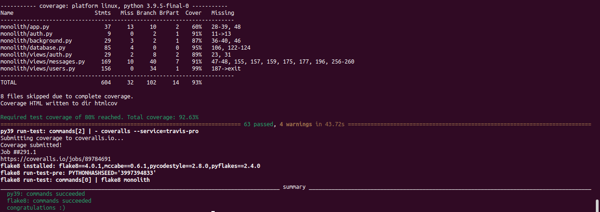

# My Message In A Bottle
[](https://app.travis-ci.com/fcarli3/message-in-a-bottle) [](https://coveralls.io/github/fcarli3/message-in-a-bottle?branch=main)

## Directory Structure
```
monolith
├── app.py
├── auth.py
├── background.py
├── database.py
├── forms.py
├── lottery.py
├── __init__.py
├── badwords.txt
├── classes
│   ├── __init__.py
├── templates
│   ├── add_to_blacklist.html
│   ├── blacklist.html
│   ├── calendar.html
│   ├── create_user.html
│   ├── index.html
│   ├── login.html
│   ├── lottery.html
│   ├── menu_notAuth.html
│   ├── menu.html
│   ├── message.html
│   ├── msgs_draft.html
│   ├── msgs_rcv.html
│   ├── msgs_sent.html
│   ├── recipients.html
│   ├── report_user.html
│   ├── report.html
│   ├── send_message.html
│   ├── user_info.html
│   └── users.html
├── tests
│   ├── __init__.py
│   ├── test_base.py
│   ├── test_blacklist.py
│   ├── test_calendar.py
│   ├── test_celery.py
│   ├── test_draft.py
│   ├── test_mailbox.py
│   ├── test_messages.py
│   └── test_user.py
└── views
    ├── __init__.py
    ├── auth.py
    ├── calendar.py
    ├── home.py
    ├── mailbox.py
    ├── messages.py
    └── users.py
```


## Installation

### Setup the environment 
To setup the environment you have to follow these steps:

1. Open the project in your IDE.
2. From IDE terminal, or normal Ubuntu/MacOS terminal execute the command `virtualenv venv` inside project root.
3. Now, you have to activate it, by executing the command `source venv/bin/activate` (you have to execute it every time you open a new terminal).
4. You have to install all requirements, let's do that with `pip install -r requirements.txt`.

## Install and run Celery 
Celery in an asynchronous task queue based on distributed message passing. The tasks are executed concurrently on a single or more worker servers. An intermediary message broker (in this case Redis) oversees passing messages between the application and Celery. In the app, Celery has been used to asynchronously deliver message, notifications and run lottery extractions.
1. Install Celery: `pip install celery`
2. Run Celery: `celery -A monolith.background.celery worker -D`

## Run the application
To run the application, execute the following commands:
1. `docker run -d -p 6379:6379 redis` run Redis on Docker in detach mode
2. `./run.sh` or set the following environment variables:
```
FLASK_APP=monolith
FLASK_ENV=development
FLASK_DEBUG=true
PYTHONPATH=$PWD
```

To monitor Celery output:
```bash
tail -f nohup.out
```

## Run tests
To run tests in isolated environemnts it has been used Tox using `tox` command from the root project folder. 

### Output

